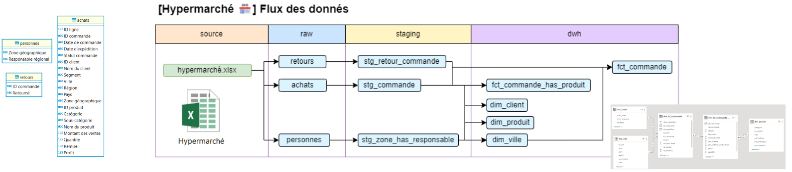

# Industrialisation données hypermarché 🛒

## Objectif & mission

### 🎯 Objectif
Apprenez à transformer et industrialiser vos données avec **dbt** : un outil qui orchestre & rend vos requêtes SQL reproductibles, testées et documentées.

### 🚀 Étapes du projet

1. **Cloner & préparer votre poste** *→ cf. [Installation](#installation)*
2. **Lancer un 1er `dbt build`** *→ comprendre et corriger les erreurs (cf. [commandes dbt](#commandes-dbt-importantes))*
3. **Migrer** vos requêtes SQL du TD1 (`input/`) *→ 1 model = 1 .sql (sans ;) (`dbt/models/xxx/`)*
4. **Documenter** vos tables & colonnes *→ fichiers `{_sources|_models}.yml`*
5. **Ajouter des tests** techniques (pk, not null) & fonctionnels (règles métiers)
6. **Explorer la documentation** et le lineage → `dbt docs generate` + `dbt docs serve`



## Resources

### Outils

- [**dbt-core**](https://github.com/dbt-labs/dbt-core) enables data analysts and engineers to transform their data using the same practices that software engineers use to build applications.\
  
- [**git**](https://git-scm.com/install/windows) *gestion de versions*
- [**VS Code**](https://code.visualstudio.com/) *éditeur de code*
  - [Power User for dbt](https://marketplace.visualstudio.com/items?itemName=innoverio.vscode-dbt-power-user)
  - [Git Graph](https://marketplace.visualstudio.com/items?itemName=mhutchie.git-graph)
- [**uv**](https://github.com/astral-sh/uv) extremely fast Python package & project manager, written in Rust.
- [**DuckDB**](https://duckdb.org/) analytical in-process SQL database
- [**DBeaver**](https://dbeaver.io/) Database Management Tool

### Se former à dbt & l'Analytics Engineering

- Suivre le tutoriel/badge [dbt-fundamentals](https://learn.getdbt.com/courses/dbt-fundamentals-vs-code)
- Consulter la [doc dbt](https://docs.getdbt.com/docs/introduction)
  ex:
  - [how we structure](https://docs.getdbt.com/best-practices/how-we-structure/1-guide-overview) our dbt projects
  - jouer avec le projet [jaffle-shop](https://github.com/dbt-labs/jaffle_shop_duckdb) ([guide](https://docs.getdbt.com/guides/duckdb?step=3))
- Alimenter sa veille & suivre sur LinkedIn
  - [Bruno Lima](https://www.linkedin.com/in/brunoszdl/) → partage bcp sur dbt
  - [Christophe Blefari](https://www.linkedin.com/in/christopheblefari/) → son regard critique sur la data ([newsletter](https://www.blef.fr/), [nao](https://getnao.io/))
  - [Robin Conquet](https://www.linkedin.com/in/robin-conquet-3a510292/) aka [DataGen](https://www.youtube.com/@data-gen) & ses podcast stratégie data
- Creuser plus loin
  - Faire les [autres eLearning dbt](https://learn.getdbt.com/courses)
  - Essayer un **quick start** dbt ?
  - lire [Continuous integration in dbt](https://docs.getdbt.com/docs/deploy/continuous-integration) → avancé
  - lire [Using defer in dbt](https://docs.getdbt.com/docs/cloud/about-cloud-develop-defer) → avancé

### Commandes dbt importantes

| Commande | Rôle |
|----------|------|
| `dbt ls` | Liste les modèles |
| `dbt parse` | Vérifie syntaxe et validité |
| `dbt compile` | Génère SQL à partir des modèles |
| `dbt run` | Exécute les modèles (sans tests) |
| `dbt test` | Lance uniquement les tests |
| `dbt build` | Exécute modèles + tests |
| `dbt build -s +stg_commande+` | Construit `stg_commande` + parent & enfants |
| `dbt retry` | Reprendre depuis la dernière erreur (run, build, test, compile, docs...) |
| `dbt docs generate` | Génère la documentation |
| `dbt docs serve` | Lance un serveur web pour explorer doc & lineage |

### Bonnes pratiques nommage des commit

Format: `<type>(<scope>): <subject>`<br>
`<scope>` is optional

- **chore:** add Oyster build script
- **docs:** explain hat wobble
- **feat:** add beta sequence
- **fix:** remove broken confirmation message
- **refactor:** share logic between 4d3d3d3 and flarhgunnstow
- **style:** convert tabs to spaces
- **test:** ensure Tayne retains clothing

### Installation

#### Récupérer les outils

- [git](https://git-scm.com/install/windows) ou
  `winget install --id Git.Git -e --source winget`
  - Dire à **git** qui vous êtes
    ```shell
    git config --global user.name "PrenomNom"
    git config --global user.email votresuper@email.fr
    ```
- [uv](https://docs.astral.sh/uv/getting-started/installation/) ou
  `powershell -ExecutionPolicy ByPass -c "irm https://astral.sh/uv/install.ps1 | iex"`
- [DuckDB](https://duckdb.org/install/?platform=windows&environment=cli) ou `winget install DuckDB.cli`
- [DBeaver](https://dbeaver.io/download/) ou [windows store](https://apps.microsoft.com/detail/9pnkdr50694p?hl=fr-FR&gl=FR)
- [VS Code](https://code.visualstudio.com/Download) ou [windows store](https://apps.microsoft.com/detail/xp9khm4bk9fz7q?hl=fr-FR&gl=FR)

#### Clone & setup local du projet

- `git clone https://github.com/AntoineGiraud/dbt_hypermarche.git`
- `cd dbt_hypermarche` <em style="color: grey">se déplacer dans le dossier récupéré avec git</em>
- `uv sync`
  - télécharge **python** <em style="color: grey">si non présent</em>
  - initialise un environnement virtuel python (venv) <em style="color: grey">si non présent</em>
  - télécharge les dépendances / extensions python
- `.venv/Scripts/activate.ps1` (unix `source .venv/bin/activate`)\
  rendre **dbt** disponible dans le terminal
- `code .` ouvrir dans VS Code le répertoire courrant
- Initialiser le hook git `pre-commit` (cf. [📹 vidéo intro](https://youtu.be/2r4uLr8MdcA) - 5min)
  - (option) `uv tool install pre-commit --with pre-commit-uv` : installation globale
  - `uv run pre-commit install` : initialiser le hook git
    - juste avec ça, sur les prochains fichiers édités, ruff sera lancé automatiquement
  - `uv run pre-commit run --all-files` : pour traiter TOUS les fichiers
